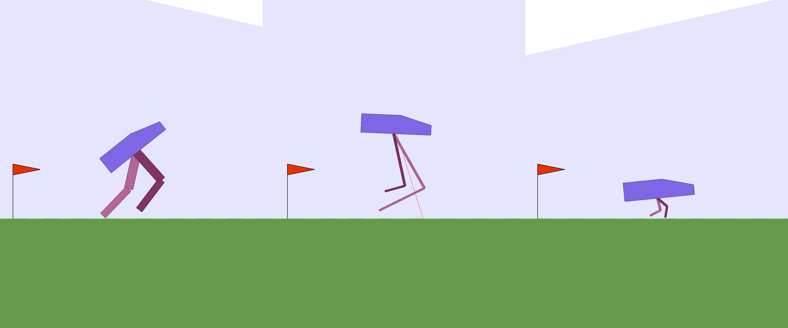
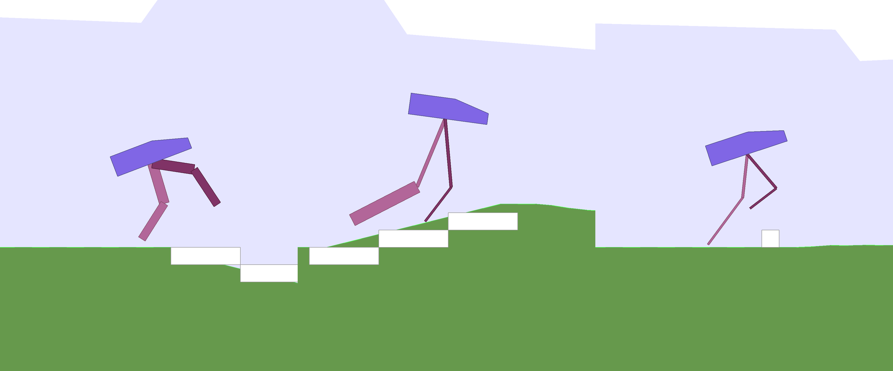
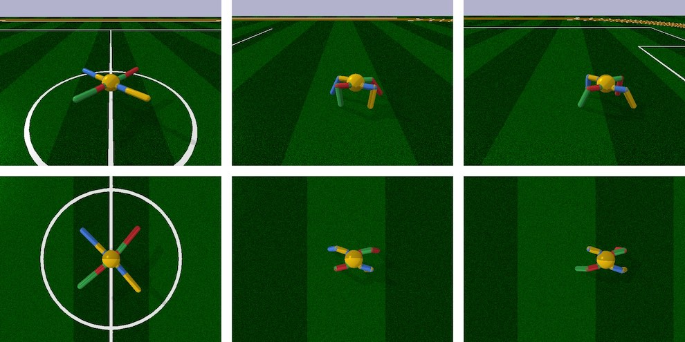
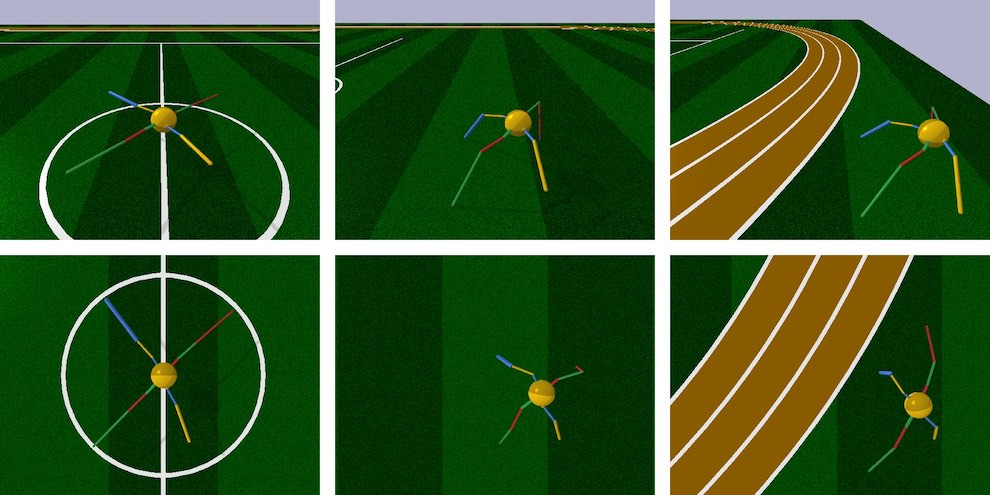
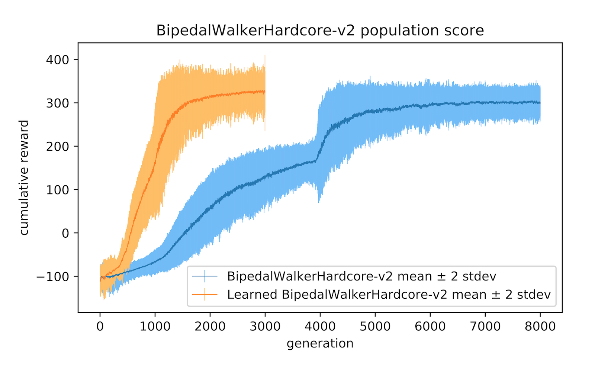
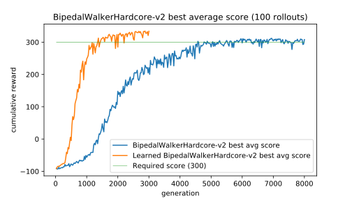
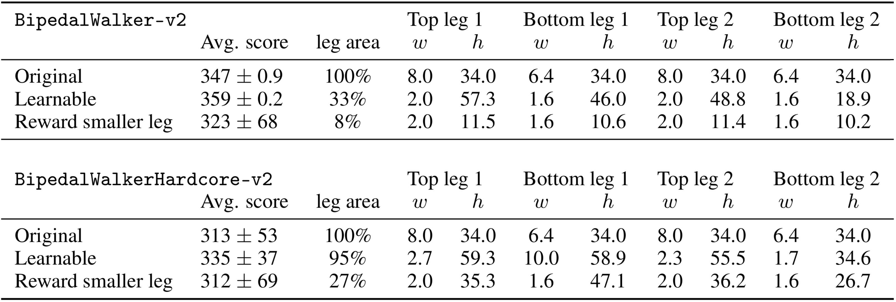

## Abstract 

In many reinforcement learning tasks, the goal is to learn a policy to manipulate an agent, whose design is fixed, to maximize some notion of cumulative reward. The design of the agent's physical structure is rarely optimized for the task at hand. In this work, we explore the possibility of learning a version of the agent's design that is better suited for its task, jointly with the policy. We propose a minor modification to the Gym<dt-cite key="openai_gym"></dt-cite> framework, where we parameterize parts of an environment, and allow an agent to jointly learn to modify these environment parameters along with its policy. We demonstrate that an agent can learn a better structure of its body that is not only better suited for the task, but also facilitates policy learning. Joint learning of policy and structure may even uncover design principles that are useful for assisted-design.

______

## Introduction

Embodied cognition<dt-cite key="anderson2003embodied,mahon2008critical,shapiro2010embodied"></dt-cite> is the theory that an organism's cognitive abilities is shaped by its body. It is even argued that an agent's cognition extends beyond its brain, and is strongly influenced by aspects of its body and also the experiences from its various sensorimotor functions<dt-cite key="wilson2002six,gover1996embodied"></dt-cite>. Evolution plays a vital role in shaping an organism's body to adapt to its environment; the brain and its ability to learn is only one of many body components that is co-evolved together<dt-cite key="pfeifer2006body"></dt-cite>. We can observe embodiment in nature by observing that many organisms exhibit complex motor skills, such as the ability to jump<dt-cite key="bresadola1998medicine"></dt-cite> or swim<dt-cite key="beal2006passive"></dt-cite> even after brain death.

While evolution shapes the overall structure of the body of a particular species, an organism can also change and adapt its body to its environment during its life. For instance, professional athletes spend their lives body training while also improving specific mental skills required to master a particular sport<dt-cite key="tricoli2005short"></dt-cite>. In everyday life, regular exercise not only strengthens the body but also improves mental conditions<dt-cite key="raglin1990exercise,deslandes2009exercise"></dt-cite>. We not only learn and improve our skills and abilities in our everyday lives, but also learn to shape our bodies for the lives we want to live.

<table style="width:100%;" cellspacing="0" cellpadding="0"><tr>
<td width="33%"><figcaption style="text-align: left;">Bipedal-v2<dt-cite key="bipedalwalker"></dt-cite>:</figcaption></td>
<td width="33%"><figcaption style="text-align: left;">Learned design:</figcaption></td>
<td width="34%"><figcaption style="text-align: left;">Optimized for smaller leg area:</figcaption></td>
</tr></table>

<table style="width:100%;" cellspacing="0" cellpadding="0"><tr>
<td width="33%"><figcaption style="text-align: left;"><i>Hardcore</i><dt-cite key="bipedalwalkerhardcore"></dt-cite> version:</figcaption></td>
<td width="33%"><figcaption style="text-align: left;">Learned design:</figcaption></td>
<td width="34%"><figcaption style="text-align: left;">Optimized for smaller leg area:</figcaption></td>
</tr></table>

We are interested to investigate embodied cognition within the reinforcement learning (RL) framework. Most baseline tasks<dt-cite key="todorov2012mujoco,roboschool"></dt-cite> in the RL literature test an algorithm's ability to learn a policy to control the actions of an agent, with a predetermined body design, to accomplish a given task inside an environment. The design of the agent's body is rarely optimal for the task, and sometimes even intentionally designed to make policy search challenging<dt-cite key="roboschool"></dt-cite>. In this work, we explore enabling learning versions of an agent's body that are better suited for its task, jointly with its policy. We demonstrate that an agent can learn a better structure of its body that is not only better for its task, but also facilitates policy learning. We can even optimize our agent's body for certain desired characteristics, such as material usage. Our approach may help uncover design principles useful for assisted-design applications.

______

## Related Work

There is a broad literature in evolutionary computation, artificial life and robotics devoted to studying, and modelling embodied cognition<dt-cite key="pfeifer2006body"></dt-cite>. In 1994, Karl Sims demonstrated that artificial evolution can produce novel morphologies that resemble organisms observed in nature<dt-cite key="sims1994evolving,sims1994evolving_MIT"></dt-cite>. Later works further investigated morphology evolution<dt-cite key="bongard2011morphological,leger1999automated"></dt-cite>, modular robotics<dt-cite key="ostergaard2003evolving,prokopenko2006evolving,zykov2007evolved"></dt-cite>, and evolving soft robots<dt-cite key="cheney2013unshackling,corucci2018evolving"></dt-cite> using indirect encoding<dt-cite key="neat,hyperneat"></dt-cite>. Theo Jansen<dt-cite key="jansen2008strandbeests"></dt-cite> used evolutionary computation to design physical *Strandbeests* creatures that can walk on their own consuming only wind energy.

<video autoplay muted playsinline loop style="display: block; margin: auto; width: 100%;"><source src="assets/mp4/related_work.mp4" type="video/mp4"/></video>
<figcaption style="text-align: left;">Evolved Virtual Creatures<dt-cite key="sims1994evolving"></dt-cite>, Soft Robots<dt-cite key="cheney2013unshackling,corucci2018evolving"></dt-cite>, <i>Strandbeest</i><dt-cite key="jansen2008strandbeests"></dt-cite> and Passive Walkers<dt-cite key="mcgeer1990passive,collins2001three"></dt-cite>.</figcaption>

Literature in the area of passive dynamics study robot designs that rely on natural swings of motion of body components instead of deploying and controlling motors at each joint<dt-cite key="mcgeer1990passive,collins2001three,paul2004morphology,collins2005efficient"></dt-cite>. Recent work in robotics investigates simultaneously optimizing body design and control of a legged robot<dt-cite key="ha2018computational"></dt-cite> using constraint-based modelling, which is related to our RL-based approach. While not directly related to agent design, machine learning-assisted approaches have been used to procedurally generate game environments that can also facilitate policy learning of the game playing agent<dt-cite key="togelius2008experiment,summerville2018procedural,volz2018evolving,guzdial2018co"></dt-cite>.

______

## Method

In this section, we describe the method used for learning a version of the agent's design better suited for its task jointly with its policy. In addition to the weight parameters of our agent's policy network, we will also parameterize the agent's environment, which includes the specification of the agent's body structure. This extra parameter vector, which may govern the properties of items such as width, length, radius, mass, and orientation of an agent's body parts and their joints, will also be treated as a learnable parameter. Hence the weights $w$ we need to learn will be the parameters of the agent's policy network combined with the environment's parameterization vector. During a rollout, an agent initialized with $w$ will be deployed in an environment that is also parameterized  with the same parameter vector $w$.

The goal is to learn $w$ to maximize the expected cumulative reward, $E[R(w)]$, of an agent acting on a policy with parameters $w$ in an environment governed by the same $w$. In our approach, we search for $w$ using a population-based policy gradient method based on Section 6 of Williams' 1992 REINFORCE<dt-cite key="williams1992"></dt-cite>. The Appendix section provides an overview of this algorithm.

<dt-code block language="python">
def rollout(agent, envparams, env):
  env.augment(envparams)
  obs = env.reset()
  done = False
  cumulative_reward = 0
  while not done:
    a = agent.action(obs)
    obs, r, done = env.step(a)
    r = augment_reward(r, envparams)
    cumulative_reward += r
  return cumulative_reward
</dt-code>
<figcaption style="text-align: left;">Using a modified OpenAI Gym<dt-cite key="openai_gym"></dt-cite>framework, we parameterize parts of an environment, and allow an agent to modify its environment before a rollout, and also augment its reward based on these parameters.</figcaption>

Armed with the ability to change the design configuration of an agent's own body, we also wish to explore encouraging the agent to challenge itself by rewarding it for trying more difficult designs. For instance, carrying the same payload using smaller legs may result in a higher reward than using larger legs. Hence the reward given to the agent may also be augmented according to its parameterized environment vector.

______

## Experiments

### Learning better legs for better gait

*RoboschoolAnt-v1*

<table style="width:100%;" cellspacing="0" cellpadding="0"><tr>
<td width="50%"><figcaption style="text-align: left;">Original <i>Ant</i> agent:</figcaption></td>
<td width="50%"><figcaption style="text-align: left;">Agent with learned design:</figcaption></td>
</tr></table>
<video autoplay muted playsinline loop style="display: block; margin: auto; width: 100%;"><source src="assets/mp4/ant_views.mp4" type="video/mp4"/></video>

In this work, we experiment on continuous control environments from Roboschool<dt-cite key="roboschool"></dt-cite>, based on the open source Bullet<dt-cite key="pybullet"></dt-cite> physics engine, and the Box2D<dt-cite key="box2d"></dt-cite> section of the OpenAI Gym<dt-cite key="openai_gym"></dt-cite> set of environments. The *RoboschoolAnt-v1*<dt-fn>A compatible version of this environment is also available in PyBullet which was used for visualization.</dt-fn> environment features a four-legged agent called the *Ant*. The body is supported by 4 legs, and each leg consists of 3 parts which are controlled by 2 motor joints. The bottom right diagram in the below figure describes the initial orientation of the agent.<dt-fn>The length of each part of a leg is controlled by the $\Delta x$ and $\Delta y$ distances from its joint connection. A size parameter also controls the radius of each leg part.</dt-fn>

<figcaption style="text-align: left;">Agent learning a policy to navigate forward in <i>RoboschoolAnt-v1</i> environment<dt-cite key="roboschool"></dt-cite>.</figcaption>

<figcaption style="text-align: left;">Agent develops longer, thinner legs while supporting the same body during training.</figcaption>

The above figure illustrates the learned agent design compared to the original design. With the exception of one leg part, it learns to develop longer, thinner legs while jointly learning to carry the body across the environment. While the original design is symmetric, the learned design breaks symmetry, and biases towards larger rear legs while jointly learning the navigation policy using an asymmetric body. The original agent achieved an average cumulative score of 3447 $\pm$ 251 over 100 trials, compared to 5789 $\pm$ 479 for an agent that learned a better body design.<dt-fn>In our experiment, we keep the volumetric mass density of all materials, along with the parameters of the motor joints identical to the original environment, and allow the 36 parameters (3 parameters per leg part, 3 leg parts per leg, 4 legs in total) to be learned. In particular, we allow each part to be scaled to a range of $\pm$ 75\% of its original value. This allows us to keep the sign and direction for each part to preserve the original intended structure of the design.</dt-fn>

*BipedalWalker-v2*

The Bipedal Walker series of environments is based on the Box2D<dt-cite key="box2d"></dt-cite> physics engine. Guided by LIDAR sensors, the agent is required to navigate across an environment of randomly generated terrain within a time limit, without falling over. The agent's payload -- its head, is supported by 2 legs. The top and bottom parts of each leg is controlled by two motor joints. In the easier *BipedalWalker-v2*<dt-cite key="bipedalwalker"></dt-cite> environment, the agent needs to travel across small random variations of a flat terrain. The task is considered solved if an agent obtains an average score greater than 300 points over 100 rollouts.

<video autoplay muted playsinline loop style="display: block; margin: auto; width: 100%;"><source src="assets/mp4/biped_compare_vs_augment.mp4" type="video/mp4"/></video>
<figcaption style="text-align: left;">Learning a policy to navigate forward in <i>BipedalWalker-v2</i> environment (left). Agent learns a body to allow it to bounce forward efficiently (right).</figcaption>

Keeping the head payload constant, and also keeping the density of materials and the configuration of the motor joints the same as the original environment, we only allow the lengths and widths for each of the 4 leg parts to be learnable, subject to the same range limit of $\pm$ 75\% of the original design. In the original environment, the agent learns a policy that is reminiscent of a joyful skip across the terrain, achieving an average score of 347. In the learned version, the agent's policy is to hop across the terrain using its legs as a pair of springs, achieving a higher average score of 359.

### Joint learning of body design facilitates policy learning

*BipedalWalkerHardcore-v2*

<video autoplay muted playsinline loop style="display: block; margin: auto; width: 100%;"><source src="assets/mp4/augmentbipedhard_all.mp4" type="video/mp4"/></video>
<figcaption style="text-align: left;">Learned body to efficiently navigate <i>BipedalWalkerHardcore-v2</i><dt-cite key="bipedalwalkerhardcore"></dt-cite>.</figcaption>

Learning a better version of an agent's body not only helps achieve better performance, but also enables the agent to jointly learn policies more efficiently. We demonstrate this in the much more challenging *BipedalWalkerHardcore-v2*<dt-cite key="bipedalwalkerhardcore"></dt-cite> version of the task. Unlike the easier version, the agent must also learn to walk over obstacles, travel up and down hilly terrain, and even jump over pits. As of writing, two methods are reported to solve this task. Population-based training<dt-cite key="stablees"></dt-cite> (our baseline), solves this task in 40 hours on a 96-CPU machine, using a small feed forward policy network. A3C<dt-cite key="mnih2016asynchronous"></dt-cite> adapted for continuous control<dt-cite key="griffis2018"></dt-cite> solves the task in 48 hours on a 72-CPU machine, but requires an LSTM<dt-cite key="lstm"></dt-cite> policy network.

<figcaption style="text-align: left;">Population-based training curves for both versions of <i>BipedalWalkerHardcore-v2</i>.</figcaption>

<figcaption style="text-align: left;">Plot of performance of best agent in the population over 100 random trials. Original version solved under 4600 generations (40 hours); learnable one solved under 1400 generations (12 hours).</figcaption>

In this environment, our agent generally learns to develop longer, thinner legs, with the exception in the real leg where it developed a thicker lower limb to serve as useful stability function for navigation. Its front legs, which are smaller and more manoeuvrable, also act as a sensor for dangerous obstacles ahead that complement its LIDAR sensors. While learning to develop this newer structure, it jointly learns a policy to solve the task in 30\% of the time it took the original, static version of the environment. The average scores over 100 rollouts for the learnable version is 335 $\pm$ 37 compared to the baseline score of 313 $\pm$ 53.

### Optimize for both the task and desired design properties

<figcaption style="text-align: left;">Summary of results for Bipedal Walker environments. Scaled Box2D dimensions reported.</figcaption>

Allowing an agent to learn a better version of its body obviously enables it to achieve better performance. But what if we want to give back some of the additional performance gains, and also optimize also for desirable design properties that might not generally be beneficial for performance? For instance, we may want our agent to learn a design that utilizes the least amount of materials while still achieving satisfactory performance on the task. Here, we reward an agent for developing legs that are smaller in area, and augment its reward signal during training by scaling the rewards by a utility factor of $1+\log(\frac{\text{orig leg area}}{\text{new leg area}})$. We see that augmenting the reward encourages development of smaller legs:

<video autoplay muted playsinline loop style="display: block; margin: auto; width: 100%;"><source src="assets/mp4/augmentbipedsmalllegs.mp4" type="video/mp4"/></video>
<figcaption style="text-align: left;">Agent rewarded for smaller legs for the task in <i>BipedalWalker-v2</i> environment.</figcaption>

This reward augmentation resulted in much a smaller agent that is still able to support the same payload. In the easier *BipedalWalker* task, given the simplicity of the task, the agent's leg dimensions eventually shrink to near the lower bound of $\sim$ 25\% of the original dimensions, with the exception of the heights of the top leg parts which settled at $\sim$ 35\% of the initial design, while still achieving an average (unaugmented) score of 323 $\pm$ 68. For this task, the leg area used is 8\% of the original design.

<video autoplay muted playsinline loop style="display: block; margin: auto; width: 100%;"><source src="assets/mp4/augmentbipedhardsmalllegs_all.mp4" type="video/mp4"/></video>
<figcaption style="text-align: left;">Agent learns the smallest pair of legs that still can solve <i>BipedalWalkerHardcore-v2</i>.</figcaption>

However, the agent is unable to solve the more difficult *BipedalWalkerHardcore* task using a similar small body structure, due to the various obstacles presented. Instead, it learns to set the widths of each leg part close to the lower bound, and instead learn the shortest heights of each leg part required to navigate, achieving a score of 312 $\pm$ 69. Here, the leg area used is 27\% of the original. 

______

## Discussion and Future Work

We have shown that allowing a simple population-based policy gradient method to learn not only the policy, but also a small set of parameters describing the environment, such as its body, offer many benefits. By allowing the agent's body to adapt to its task within some constraints, it can learn policies that are not only better for its task, but also learn them more quickly.

The agent may discover design principles during this process of joint body and policy learning. In both *RoboschoolAnt* and *BipedalWalker* experiments, the agent has learned to break symmetry and learn relatively larger rear limbs to facilitate their navigation policies. While also optimizing for material usage for *BipedalWalker*'s limbs, the agent learns that it can still achieve the desired task even by setting the size of its legs to the minimum allowable size. Meanwhile, for the much more difficult *BipedalWalkerHardcore-v2* task, the agent learns the appropriate length of its limbs required for the task while still minimizing the material usage.

This approach may lead to useful applications in machine learning-assisted design, in the spirit of<dt-cite key="carter2017"></dt-cite>. Game designers can optimize the designs of game character assets while at the same time being able to constrain the characters to keep the essence of their original forms. Optimizing character design may complement existing work on machine learning-assisted procedural content generation for game design<dt-cite key="togelius2008experiment,summerville2018procedural,volz2018evolving,guzdial2018co"></dt-cite>. By framing the approach within the popular OpenAI Gym framework, design firms can create more realistic environments -- for instance, incorporate strength of materials, safety factors, malfunctioning of components under stressed conditions, and plug existing algorithms into this framework to optimize also for design aspects such as energy usage, easy-of-manufacturing, or durability. The designer may even incorporate aesthetic constraints such as symmetry and aspect ratios that suits her design sense.

In this work we have only explored using a simple population-based policy gradient method<dt-cite key="williams1992"></dt-cite> for learning. State-of-the-art model-free RL algorithms, such as TRPO<dt-cite key="schulman2015trust"></dt-cite> and PPO <dt-cite key="schulman2017proximal"></dt-cite> work well when our agent is presented with a well-designed dense reward signal, while population-based methods offer computational advantages for sparse-reward problems<dt-cite key="openai_es,DeepNeuroevolution2017"></dt-cite>. In our setting, since the body design is parameterized by a small set of learnable parameters and is only set once at the beginning of a rollout, the problem of learning the body along with the policy becomes more sparse. In principle, we could allow an agent to augment its body *during* a rollout to obtain a dense reward signal, but we find this unpractical for realistic problems. Future work may look at separating the learning from dense-rewards and sparse-rewards into an inner loop and outer loop, and also examine differences in performance and behaviours in structures learned using various different learning approaches.

Separation of policy learning and body design into inner loop and outer loop will also enable the incorporation of evolution-based approaches to tackle the vast search space of morphology design, while utilizing efficient RL-based methods for policy learning. The limitations of the current approach is that our RL algorithm can learn to optimize only existing design properties of an agent's body, rather than learn truly novel morphology in the spirit of Karl Sims's *Evolving Virtual Creatures*<dt-cite key="sims1994evolving"></dt-cite>.

Nevertheless, our approach of optimizing the specifications of an existing design might be more practical for many applications. An evolutionary algorithm might come up with trivial designs and corresponding simple policies that outperform designs we actually want -- for instance, a large ball that rolls forward will easily outperforming the best bipedal walkers, but this might not be useful to a game designer who simply wants to optimize the dimensions of an existing robot character for a video game. Due to the vast search space of morphology, a search algorithm can easily come up with a trivial, but unrealistic or unusable design that exploits its simulation environment<dt-cite key="lehman2018surprising"></dt-cite>, which may be why subsequent morphology-evolution approaches constrain the search space of the agent's morphology, such as constraining to the space of soft-body voxels<dt-cite key="cheney2013unshackling"></dt-cite> or constraining to a set of possible pipe frame connection settings<dt-cite key="jansen2008strandbeests"></dt-cite>.

Just as REINFORCE<dt-cite key="williams1992"></dt-cite> can also be applied to the discrete search problem of neural network architecture designs<dt-cite key="zoph2016neural"></dt-cite>, similar RL-based approaches could be used for novel morphology design -- not simply for augmenting and improving existing designs like in this work. We believe the ability to learn useful morphology is an important area for the advancement of AI. Although morphology learning originally initiated from the field of evolutionary computation, we hope this work will engage the RL community to investigate the concept further and encourage idea exchange across communities.